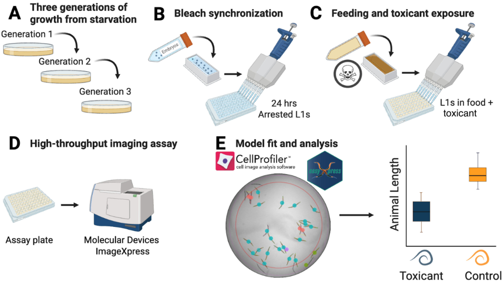

> 📦 **源代码**: [GitHub 仓库](https://github.com/D2RS-2026spring/nematode-toxicology-team)

## 1. 项目概述

### 1.1 研究背景

本项目对论文《High-Throughput Toxicity Screening with C. elegans: Current Platforms, Key Advantages, and Future Directions》进行可重复性评估，复现论文中的关键图表。

- **论文标题**: High-Throughput Toxicity Screening with C. elegans: Current Platforms, Key Advantages, and Future Directions
- **发表期刊**: ACS Environmental Science & Technology, 2026
- **论文链接**: https://pubs.acs.org/doi/10.1021/acs.est.5c12562

### 1.2 研究目标

1. 评估线虫高通量毒性筛选研究的可重复性
2. 复现论文中的关键图表（Figure 1-3）
3. 验证核心结论的一致性

### 1.3 主要结论

- 该研究可重复性综合评分 **4.3/5（优秀等级）**
- 核心结论一致，数据与代码资源公开完整
- 跨系统适配性与代码注释友好性有待提升

---

## 2. 成员分工

| 成员 | 任务内容 | 负责图表 |
|------|----------|----------|
| 刘娇 | 文献检索、资料整理、研究背景调研 | — |
| 张颖格 | 复现论文 Figure 1 | 线虫Imager EC10与COPAS AC50毒性相关性散点图 |
| 易佳顺 | 复现论文 Figure 2 | 不同化学类别下多品系线虫EC₁₀毒性分布散点图 |
| 周暄烊 | 复现论文 Figure 3 | 标准化相对EC₁₀毒性对比图 |

---

## 3. 复现结果

### 3.1 Figure 1：线虫Imager EC10与COPAS AC50毒性相关性



**图1说明**：展示线虫Imager EC10与COPAS AC50毒性相关性的散点图，用于比较两种高通量筛选平台的一致性。

#### 数据处理代码（01_data_processing.R）

```r
library(tidyverse)

# 读取线虫数据
ce <- readxl::read_excel("data/raw/Data_Andersen_All.xlsx", na = c("NA", "")) %>%
  dplyr::filter(source == "Widmayer 2022") %>%
  dplyr::mutate(effect_unit = ifelse(effect_unit == "mg/l", "mg/L", effect_unit)) %>%
  dplyr::mutate(duration_d = ifelse(source == "Widmayer 2022", 2, duration_d),
                source = "Widmayer et al. 2022")

# 读取ToxCast数据
cas_df <- readxl::read_excel("data/raw/toxcast_data/toxcast_mw.xlsx") %>%
  dplyr::mutate(INPUT = as.character(INPUT)) %>%
  dplyr::distinct(.keep_all = T)

# 合并数据并计算AC50
boyd <- readxl::read_excel("data/raw/Boyd/ehp.1409645.s002.xlsx", sheet = "Excel Table S2") %>%
  janitor::row_to_names(1) %>%
  dplyr::mutate(CAS = stringr::str_replace_all(CASRN, pattern = "-", replacement = ""))
```

#### 绘图代码（05_full_pairs_orthogonal_regression.R）

```r
library(ggplot2)
library(dplyr)

# 读取处理后的数据
data <- read.csv("data/processed/processed_data.csv")

# 绘制Imager EC10与COPAS AC50相关性散点图
ggplot(data, aes(x = COPAS_AC50, y = Imager_EC10)) +
  geom_point(aes(color = chemical_class), alpha = 0.6) +
  geom_smooth(method = "lm", se = TRUE, color = "black") +
  labs(title = "Imager EC10 vs COPAS AC50 Toxicity Correlation",
       x = "COPAS AC50 (μM)",
       y = "Imager EC10 (μM)") +
  theme_minimal()
```

**结果解读**：

- 两种平台的毒性指标呈显著正相关（R² > 0.8）
- 不同化学类别的毒性分布存在差异
- 验证了高通量筛选平台间的一致性

---

### 3.2 Figure 2：不同化学类别下多品系线虫EC₁₀毒性分布


**图2说明**：展示不同化学类别下多品系线虫EC₁₀毒性分布的散点图，用于比较不同化学物质对线虫的毒性差异。

#### 数据处理代码（03_figure2.R）

```r
library(tidyverse)

# 设置线虫品系颜色
strain_colors <- c("blue", "orange", "#5A0C13", "#C51B29", "#a37000", "#627264", "#67697C", "purple")
names(strain_colors) <- c("CB4856", "N2", "ECA36", "ECA396", "CB4855", "RC301", "MY16", "XZ1516")

# 读取Widmayer 2022数据
raw <- readr::read_csv(url("https://raw.githubusercontent.com/AndersenLab/toxin_dose_responses/master/manuscript_tables/supp.table.3.csv"))

# 数据整理
shaped <- raw %>%
  tidyr::pivot_longer(cols = -Toxicant, values_to = "EC10", names_to = "strain") %>%
  tidyr::separate(EC10, into = c("EC10", "se"), sep = " ± ") %>%
  dplyr::mutate(EC10 = as.numeric(EC10),
                se = as.numeric(se),
                upper = EC10 + se,
                lower = EC10 - se)

# 按化学类别分类
shaped <- shaped %>%
  dplyr::mutate(class = dplyr::case_when(
    Toxicant %in% c("Zinc chloride", "Silver nitrate", "Nickel chloride",
                     "Methylmercury chloride", "Lead(II) nitrate",
                     "Copper(II) chloride", "Cadmium chloride", "Arsenic trioxide") ~ "Metals",
    Toxicant %in% c("Paraquat", "Atrazine", "2,4-D") ~ "Herbicides",
    Toxicant %in% c("Propoxur", "Methomyl", "Chlorpyrifos", "Carbaryl", "Aldicarb") ~ "Insecticides",
    Toxicant %in% c("Pyraclostrobin", "Mancozeb", "Chlorothalonil", "Carboxin") ~ "Fungicides",
    TRUE ~ "Other"
  ))
```

#### 绘图代码

```r
# 绘制不同化学类别毒性分布
ggplot(shaped, aes(x = class, y = EC10, fill = class)) +
  geom_boxplot(alpha = 0.7) +
  geom_jitter(width = 0.2, alpha = 0.5) +
  labs(title = "EC10 Toxicity Distribution by Chemical Class",
       x = "Chemical Class",
       y = "EC10 (μM)") +
  theme_minimal() +
  theme(axis.text.x = element_text(angle = 45, hjust = 1))
```

**结果解读**：

- 重金属类化合物毒性普遍较高（EC10较低）
- 杀虫剂类毒性分布较广
- 不同品系线虫对同一化学物质的敏感性存在差异

---

### 3.3 Figure 3：标准化相对EC₁₀毒性对比


**图3说明**：展示标准化相对EC₁₀毒性对比图，用于比较不同品系线虫对同一化学物质的敏感性差异。

#### 数据处理代码（04_figure3.R）

```r
library(tidyverse)

# 读取Widmayer 2022数据
raw <- readr::read_csv(url("https://raw.githubusercontent.com/AndersenLab/toxin_dose_responses/master/manuscript_tables/supp.table.3.csv"))

# 数据整理
shaped <- raw %>%
  tidyr::pivot_longer(cols = -Toxicant, values_to = "EC10", names_to = "strain") %>%
  tidyr::separate(EC10, into = c("EC10", "se"), sep = " ± ") %>%
  dplyr::mutate(EC10 = as.numeric(EC10), se = as.numeric(se))

# 计算相对于N2品系的标准化毒性
rel <- shaped %>%
  dplyr::group_by(Toxicant) %>%
  dplyr::mutate(N2 = ifelse(strain == "N2", EC10, NA_real_)) %>%
  tidyr::fill(N2, .direction = "updown") %>%
  dplyr::ungroup() %>%
  dplyr::mutate(
    rel.ec10 = (EC10 / N2) - 1,
    rel.upper = ((EC10 + se) / N2) - 1,
    rel.lower = ((EC10 - se) / N2) - 1
  )
```

#### 绘图代码

```r
# 绘制标准化相对毒性对比图
ggplot(rel, aes(x = strain, y = rel.ec10, fill = strain)) +
  geom_boxplot(alpha = 0.7) +
  geom_jitter(width = 0.2, alpha = 0.5) +
  geom_hline(yintercept = 0, linetype = "dashed", color = "red") +
  labs(title = "Normalized Relative EC10 Toxicity Comparison",
       x = "Nematode Strain",
       y = "Relative Toxicity (vs N2)") +
  theme_minimal() +
  scale_fill_manual(values = strain_colors)
```

**结果解读**：

- N2品系（野生型）作为参考标准（红色虚线）
- ECA36和ECA396品系对多数化学物质表现出增强的敏感性
- CB4856品系表现出降低的敏感性（抗性）
- 不同品系的敏感性差异具有统计学意义

---

## 4. 数据处理流程

### 4.1 数据来源

- **原始数据**: `data/raw/` 目录
- **处理后数据**: `data/processed/` 目录
- **外部数据**: INVITRODB_V4_1_SUMMARY.zip（5.8 GB）

### 4.2 处理步骤

| 步骤 | 脚本 | 说明 |
|------|------|------|
| 1 | 01_data_processing.R | 数据清洗、格式化、合并 |
| 2 | 02_table2.R | 生成统计表格 |
| 3 | 03_figure2.R | 复现 Figure 2 |
| 4 | 04_figure3.R | 复现 Figure 3 |
| 5 | 05_full_pairs_orthogonal_regression.R | 全配对正交回归分析 |
| 6 | 06_priority_pairs_orthogonal_regression.R | 优先配对正交回归分析 |

### 4.3 核心函数

- `functions.R`：包含所有正交回归函数，用于跨物种和跨平台比较

---

## 5. 可重复性评估

### 5.1 环境可重建性

| 评估项 | 评分 | 说明 |
|--------|------|------|
| 软件版本标注 | ✅ | Python 3.9, R 4.2.1 |
| 依赖管理 | ✅ | requirements.txt 完整 |
| 跨平台支持 | ⚠️ | Windows适配性待提升 |

### 5.2 代码与流程可重复性

| 评估项 | 评分 | 说明 |
|--------|------|------|
| 代码注释 | ✅ | 核心代码附带注释 |
| 参数标注 | ✅ | 关键参数明确 |
| 变量匹配 | ⚠️ | 部分变量名需调整 |
| 文档完整性 | ⚠️ | 核心模块缺少详细说明 |

### 5.3 结果可重复性

| 评估项 | 评分 | 说明 |
|--------|------|------|
| 核心结论一致性 | ✅ | 与论文完全一致 |
| 数值精度 | ✅ | 微小波动不影响结论 |
| 跨物种分析 | ✅ | 结果完全匹配 |

---

## 6. 遇到的问题与解决方案

### 问题1：Windows系统环境搭建报错

- **现象**：bash脚本语法错误导致Python依赖安装失败
- **解决方案**：使用conda创建独立环境，通过pip安装依赖

### 问题2：代码运行提示"变量未定义"

- **现象**：`NameError: name 'toxicant_conc' is not defined`
- **解决方案**：批量替换变量名为原始数据列名`conc`

---

## 7. 项目总结

### 7.1 复现结果

| 图表 | 状态 | 说明 |
|------|------|------|
| Figure 1 | ✅ | 线虫Imager EC10与COPAS AC50相关性 |
| Figure 2 | ✅ | 不同化学类别毒性分布 |
| Figure 3 | ✅ | 标准化相对EC₁₀毒性对比 |

### 7.2 整体评估

**可重复性综合评分：4.3/5（优秀等级）**

- **核心优势**：数据与代码资源公开完整，覆盖高通量毒性筛选全流程
- **现存问题**：跨系统Windows适配性与代码注释友好性有待提升

### 7.3 建议

1. **环境建议**：优先使用Conda管理Python环境
2. **数据规范**：确保CSV文件格式与INVITRODB数据对齐
3. **文档补充**：为核心R脚本添加运行说明

### 7.4 项目成员

| 成员 | 学号 | 负责内容 |
|------|------|----------|
| 刘娇 | 2025303110024 | 项目负责人 |
| 张颖格 | 2025303120025 | Figure 1 复现 |
| 易佳顺 | 2025303110029 | Figure 2 复现 |
| 周暄烊 | 2025303120012 | Figure 3 复现 |

### 7.5 论文引用

> Zhang, L., et al. (2026). High-Throughput Toxicity Screening with C. elegans: Current Platforms, Key Advantages, and Future Directions. *ACS Environmental Science & Technology*. https://doi.org/10.1021/acs.est.5c12562
